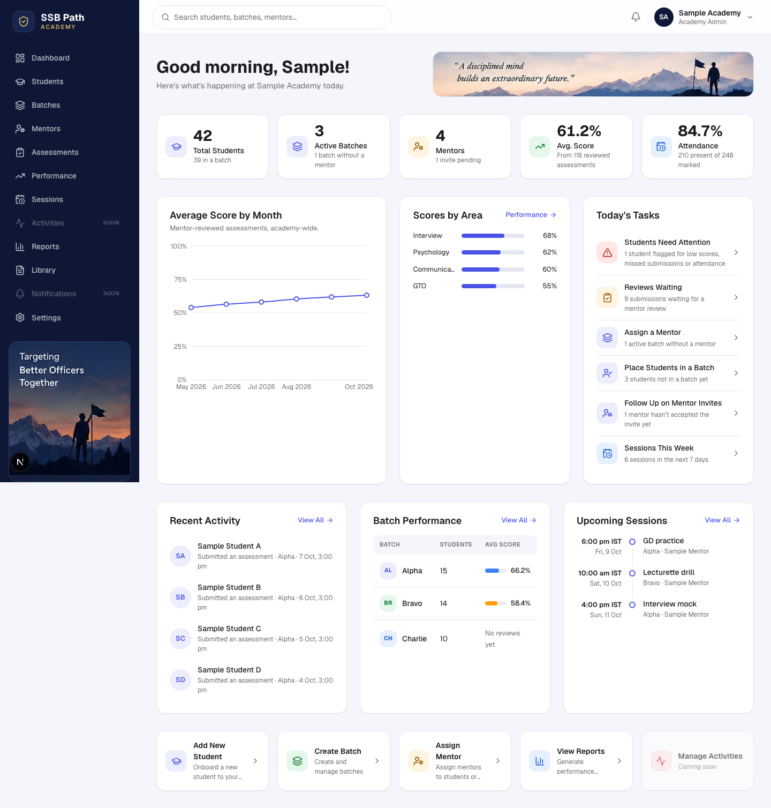
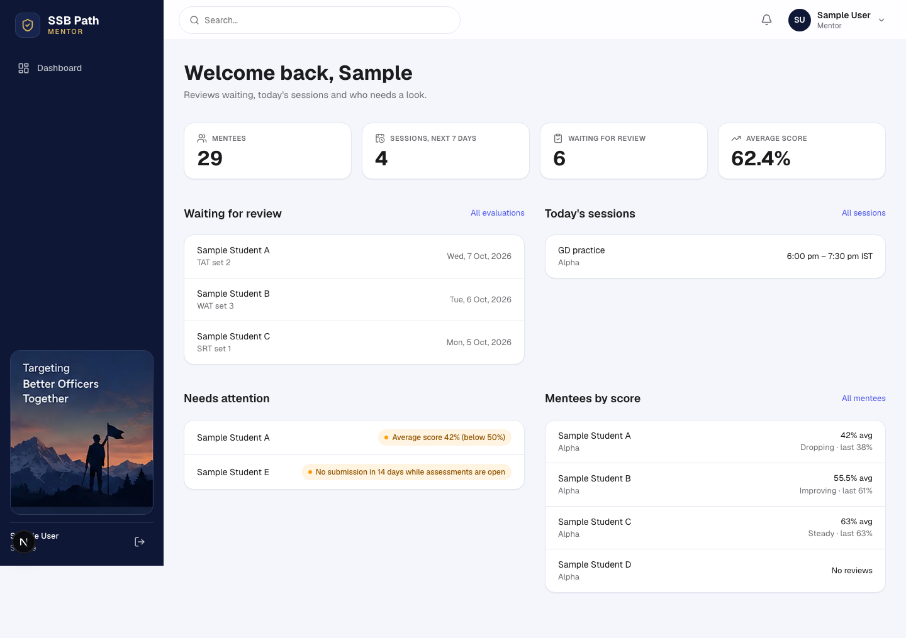
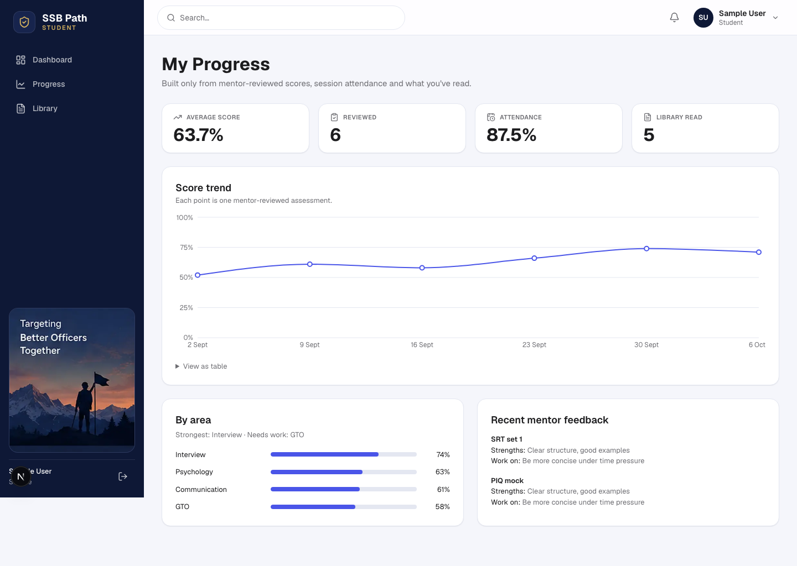
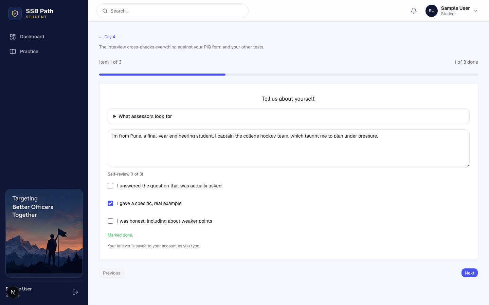
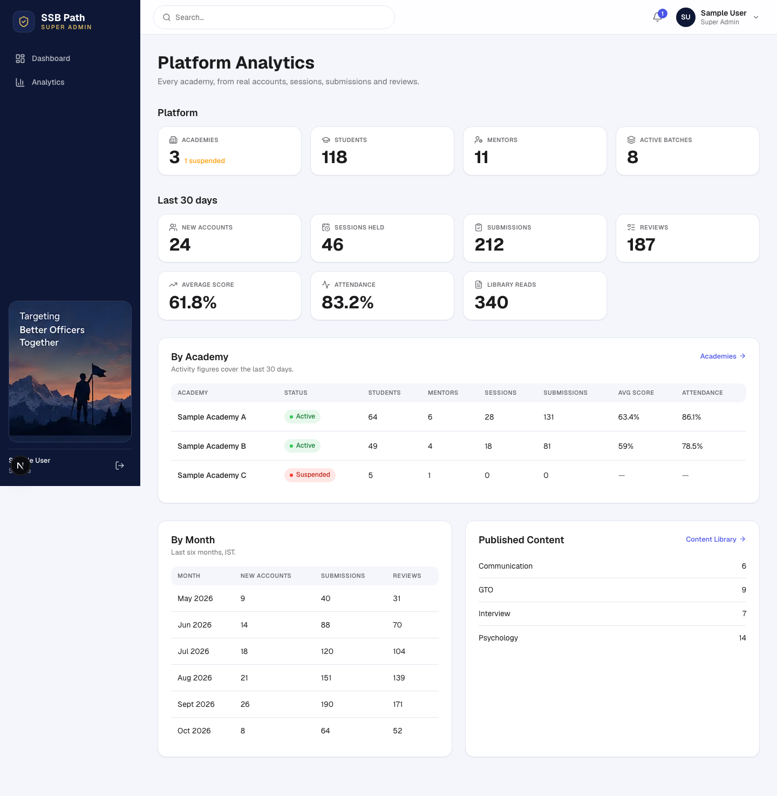
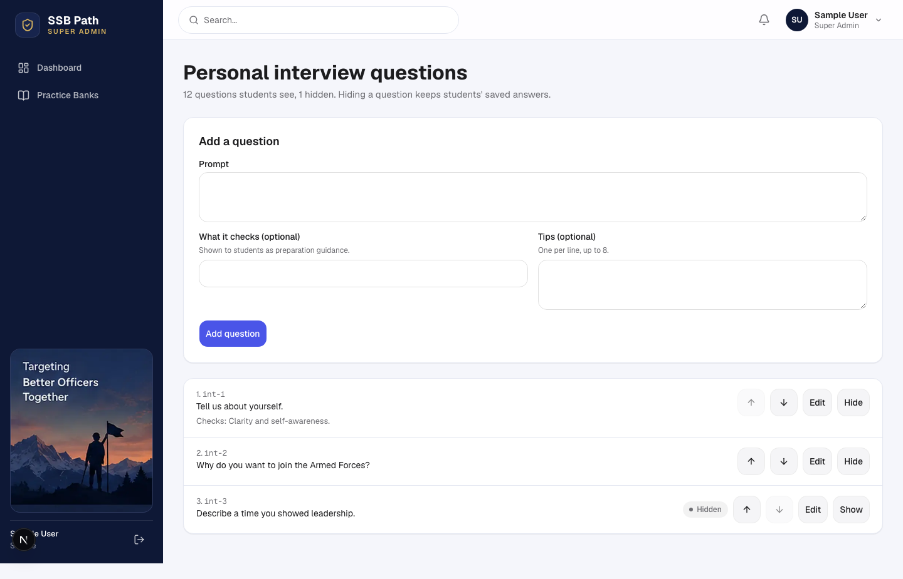
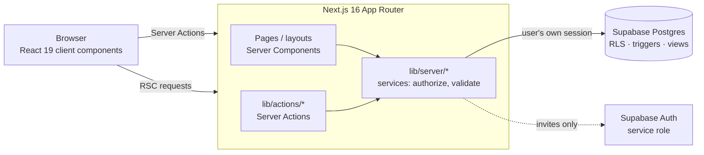

<div align="center">

# SSB Academy

**A role-based preparation platform for India's Services Selection Board (SSB) interview —
for students, their mentors, the academies that train them, and the team that runs it all.**

[](https://github.com/gaurav-vv/EliteCadet-ssb/actions/workflows/ci.yml)


[Features](#features) · [Screenshots](#screenshots) · [Architecture](#architecture) · [Security](#security-model) · [Getting started](#getting-started) · [Testing](#testing) · [Docs](#project-docs)

</div>

---

## Why

SSB selection runs over five days — screening, psychology tests, group tasks, a personal interview
and a final conference. Candidates usually prepare alone, mentors juggle notes and spreadsheets, and
academies can't see who is falling behind until it's too late.

SSB Academy puts the whole preparation loop in one place:

```text
Student   Practise  →  get mentor feedback  →  improve  →  practise again
Mentor    See mentees  →  review their work  →  evaluate  →  follow up
Academy   Organise batches  →  monitor progress  →  act on who needs attention
```

Every number on every screen comes from real rows in the database — no sample figures, no invented
"readiness" scores.

## Features

### Students
- **5-day SSB practice journey** — OIR (verbal and non-verbal), PPDT, TAT, WAT, SRT, SDT, interview and
  conference practice, self-paced or as timed tests that mirror the real format.
- **Answers saved to the account** as you type, with a retry that never loses text; timed tests are
  scored on the server.
- **Mock interview and mock conference**, including questions built from the student's own PIQ form.
- **Assessments** from mentors — draft, submit once, then read structured feedback.
- **My Progress** — score trend, averages by area, strength and weak area, attendance, rule-based next
  steps that always say *why*.
- **Dashboard** with Today's Mission, practice streak, next session and recent feedback.
- Sessions calendar, a role-scoped content Library and in-app notifications.

### Mentors
- Mentees from **their batches only**, with average score, attendance and a full progress view.
- **Session scheduling** with availability, no double-booking and attendance marking.
- **Assessments and evaluations** — recoverable draft reviews, locked final reviews with score,
  strengths and improvement areas.
- Each mentee's own **practice answers** and test results.
- **My Content** — create material, start from platform templates, publish to their batches, or
  request custom content from the platform team.

### Academy admins
- Students, batches and mentors, with batch membership as a first-class concept.
- **Performance** — per-batch averages, attendance, practice activity and a *Needs attention* list
  with the reason for each flag.
- Dashboard tasks (reviews waiting, batches without a mentor, unplaced students, pending invites) and
  reports.

### Super admin
- Users, roles and academies across the platform.
- The global **Content Library** and **Practice Banks** (add, edit, reorder, hide questions).
- Content requests with quotes, and **Platform Analytics** across every academy.

## Screenshots

> Rendered locally with clearly labelled sample data.

| Academy dashboard | Mentor dashboard |
|---|---|
|  |  |

| Student progress | Student practice, saved to the account |
|---|---|
|  |  |

| Platform analytics | Practice bank editor |
|---|---|
|  |  |

## Architecture



- **Server-first.** Pages are Server Components; `"use client"` only where a screen is interactive.
- **One service layer.** Each domain lives in `lib/server/<domain>/` — pure validation (unit tested),
  a service that checks the role and scope first, and errors mapped to plain language. Server Actions
  in `lib/actions/` are thin entry points.
- **The database enforces the rules too.** Row-level security, triggers and security-invoker views
  mean a bug in the app can't leak another academy's data or skip a lifecycle rule.
- **Derived, not duplicated.** Progress, dashboards and analytics are computed from source rows
  (reviewed feedback, attendance, practice) rather than stored copies.

### Project structure

```text
app/                 routes: (public), student, mentor, academy, admin
components/          UI by area (practice, progress, dashboards, academy, admin, ui)
lib/server/          domain services: users, academies, academy-people, content, sessions,
                     assessments, progress, dashboards, notifications, analytics, practice
lib/actions/         Server Actions
lib/practice/        5-day journey structure and timing
types/               shared domain types
supabase/migrations/ 0001–0014, applied in order
supabase/tests/      end-to-end database workflow check
tests/               Vitest unit + integration, Playwright e2e
```

## Security model

| Concern | How it's handled |
|---|---|
| Roles | `student`, `mentor`, `academy_admin`, `super_admin`. The role comes from service-role-only `app_metadata`; a role sent from the browser at sign-up is ignored. |
| Authorization | Checked server-side in every service **and** by Postgres RLS. Hiding a route is never the only guard. |
| Academy isolation | The academy always comes from the signed-in session, never the request. Cross-academy reads and writes are refused by RLS. |
| IDOR | Changing an id in a URL returns *not found* unless the resource is in the caller's scope. |
| Lifecycles | Triggers enforce them: questions lock once an assessment opens, one submission per student, final reviews lock, attendance only after a session starts. |
| Notifications | Written by database triggers; clients can't create them and can only mark their own as read. |
| Secrets | Never in the browser. The service-role key is used only server-side, for invites. |

## Getting started

**Prerequisites:** Node.js 22+, npm, and a Supabase project.

```bash
git clone https://github.com/gaurav-vv/EliteCadet-ssb.git
cd EliteCadet-ssb
npm ci
```

Create `.env.local`:

```bash
NEXT_PUBLIC_SUPABASE_URL=https://<your-project>.supabase.co
NEXT_PUBLIC_SUPABASE_ANON_KEY=<anon key>
SUPABASE_SERVICE_ROLE_KEY=<service role key>   # server only — used for invites
```

Apply the migrations in the Supabase SQL Editor, **in order**: `supabase/migrations/0001` → `0014`.
Run `0004_super_admin_role.sql` on its own — Postgres can't use a new enum value in the transaction
that adds it.

```bash
npm run dev        # http://localhost:3000
```

## Testing

```bash
npm run lint
npm run typecheck
npm run test:unit
npm run test:integration
npm run test:e2e
```

The database layer has its own end-to-end check. It applies every migration to a **throwaway local
Postgres** and walks the whole workflow as each role under real RLS — isolation, lifecycles,
notifications, progress, analytics and practice:

```bash
PGHOST=127.0.0.1 PGPORT=5432 PGUSER=postgres supabase/tests/run-workflow-check.sh
```

> Never point it at a real project — it drops and recreates its own database.

CI runs lint, type checks, unit and integration tests, the production build and Playwright on every
pull request.

## Project docs

| File | Answers |
|---|---|
| [`specs.md`](./specs.md) | What the product must do |
| [`AGENTS.md`](./AGENTS.md) | How it's built — architecture, conventions, design system |
| [`task.md`](./task.md) | What's being built, in what order |
| [`status.md`](./status.md) | The verified state of the repository today |
| [`tests/TEST_CASES.md`](./tests/TEST_CASES.md) | Every test case and how it's verified |

## Contributors

Built by the EliteCadet team. Platform build-out — roles and RBAC, academies, batches, content,
sessions, assessments, progress, dashboards, notifications, analytics and saved practice — by
[**@mani6409**](https://github.com/mani6409).

<div align="center"><sub>Preparation guidance only — SSB Academy never predicts a selection outcome.</sub></div>
