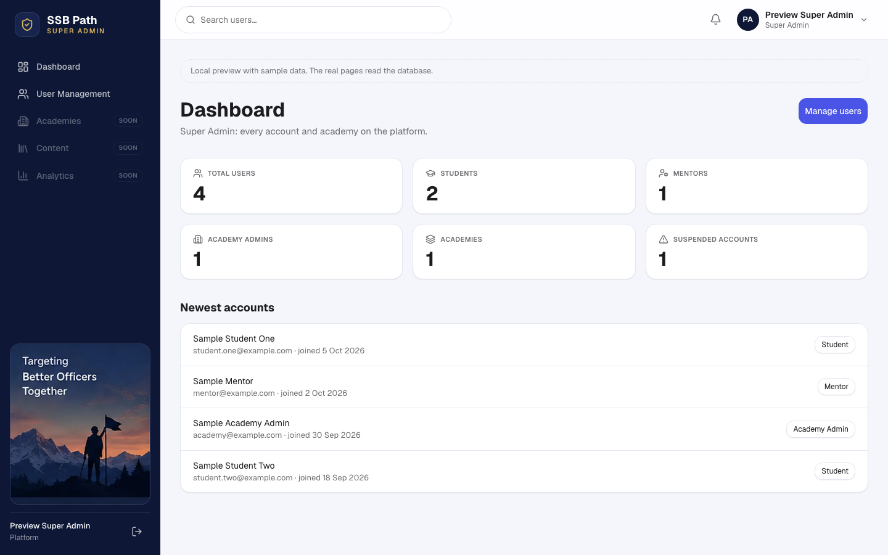
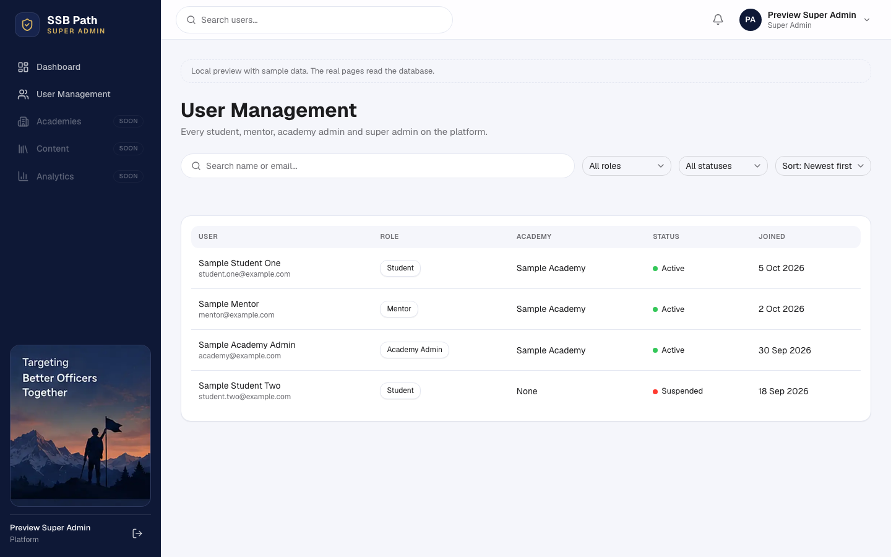
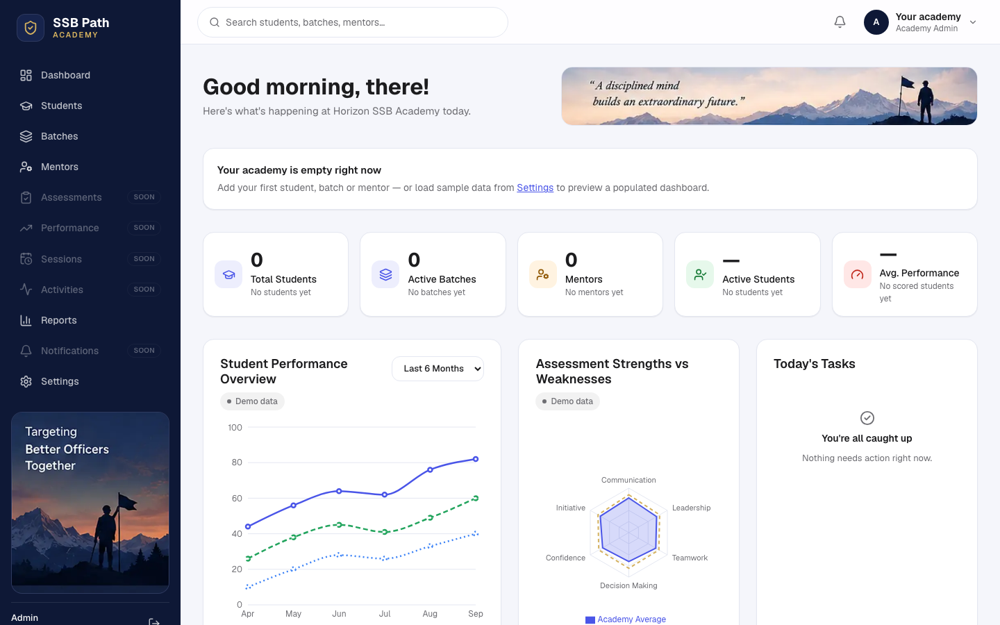
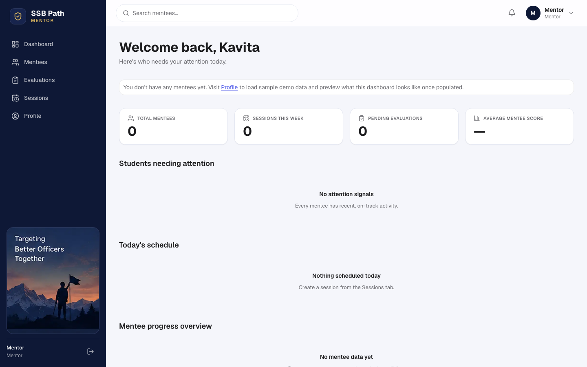
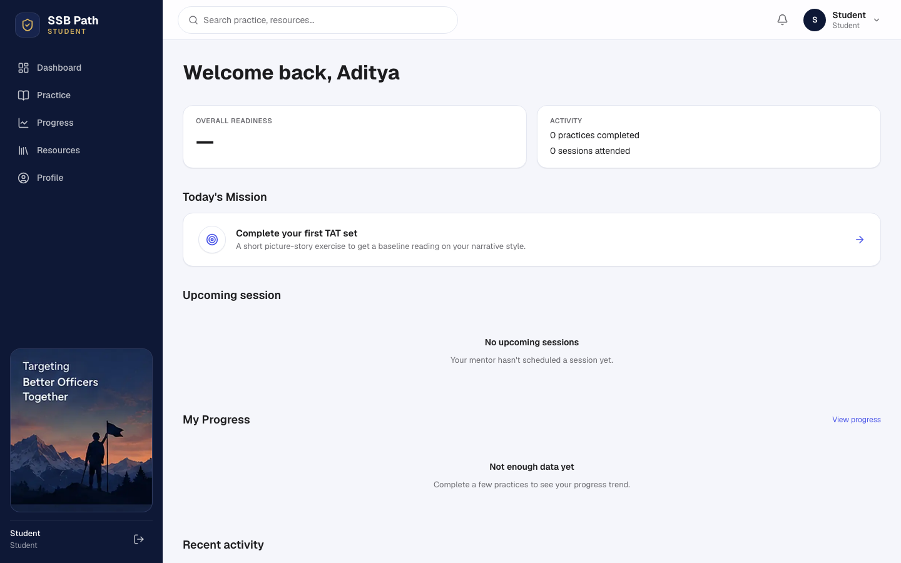
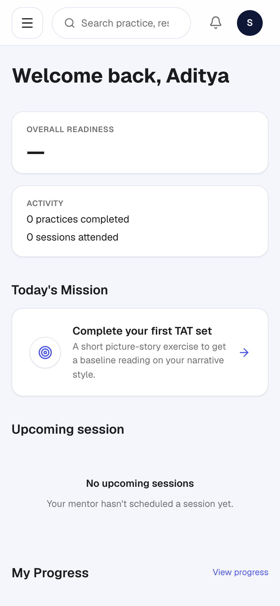
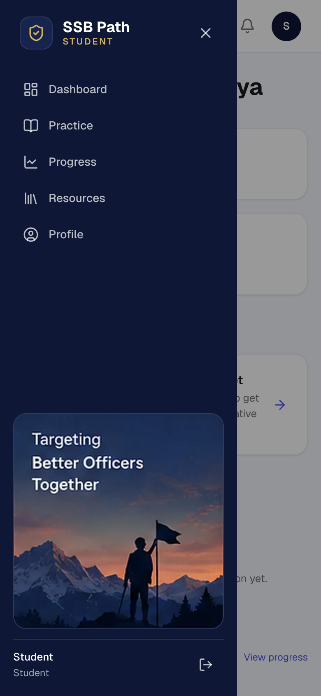

# Workspace screenshots (2026-10-08)

The four role workspaces after PR #8 (Super Admin, Phase 1) and PR #9 (one navy workspace shell)
are both merged, with `/admin` on the shared shell. Captured at 1440×900 (desktop) and 390×844
(phone) from a local build.

- **Super Admin** screens use **sample data** (names like "Sample Mentor"). The real pages read the
  database, which wasn't connected for the capture.
- **Academy, Mentor and Student** are the real pages in their empty state (no database connected).
  The Academy charts are labelled "Demo data". The Mentor/Student greetings ("Kavita", "Aditya")
  come from the existing demo modules and are removed when those dashboards move to real data
  (T088).

These are a visual record for review, not production data (`AGENTS.md` §8).

| Workspace | Screenshot |
|---|---|
| Super Admin: Dashboard |  |
| Super Admin: User Management |  |
| Academy Admin: Dashboard |  |
| Mentor: Dashboard |  |
| Student: Dashboard |  |
| Student: phone |  |
| Student: phone menu |  |
